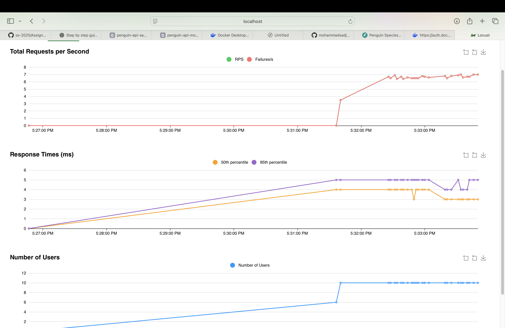

# Deployment Report – Penguin Species Prediction API

## 1. Deployment Environment

- **Framework:** FastAPI
- **Model Storage:** Google Cloud Storage (GCS)
- **Deployment Method:** Docker container running locally
- **Load Testing Tool:** Locust

## 2. Steps Taken

### Step 1: Model Preparation
- Trained an XGBoost model using penguin dataset.
- Saved the model as `model.json`.

### Step 2: Upload to Google Cloud Storage (GCS)
- Created a GCS bucket: `penguin-api-models`
- Uploaded `model.json` to that bucket.
- Set up a Google service account and downloaded the credentials JSON.
- Added the path to `.env`:
  ```
  GOOGLE_APPLICATION_CREDENTIALS=gcp-key.json
  GCS_BUCKET_NAME=penguin-api-models
  GCS_BLOB_NAME=model.json
  ```

### Step 3: API Setup with FastAPI
- Created `main.py` to load model from GCS on startup.
- Implemented `/predict` endpoint using the model.

### Step 4: Testing
- Wrote unit tests in `tests/test_api.py`
- Ran tests with `pytest` — all passed ✅

### Step 5: Dockerization
- Created `Dockerfile` and `.dockerignore`
- Built the Docker image:  
  ```
  docker build -t penguin-api .
  ```

### Step 6: Manual Deployment
- Ran Docker container locally:
  ```
  docker run -p 8080:8080 \
    -v $(pwd)/gcp-key.json:/gcp/sa-key.json:ro \
    -e GOOGLE_APPLICATION_CREDENTIALS=/gcp/sa-key.json \
    -e GCS_BUCKET_NAME=penguin-api-models \
    -e GCS_BLOB_NAME=model.json \
    penguin-api
  ```

- Confirmed app was running at: `http://localhost:8080/docs`

## 3. Load Testing with Locust

- Launched Locust UI:  
  ```
  locust
  ```
- Visited `http://localhost:8089`
- Entered:
  - Number of users: `10`
  - Ramp-up: `2`
  - Host: `http://localhost:8080`

- Clicked **Start swarming**
- Observed stats table and graphs for `/predict` endpoint



---

## 4. Outcome

- Model loads successfully from GCS
- API responds correctly to predictions
- Docker container runs and exposes the API on port `8080`
- Load testing shows consistent performance and 0% failure rate ✅

---

## 5. Challenges Faced

- Needed to install Docker on macOS
- Faced permission error with GCS — fixed by adjusting service account roles
- Required corrections to dependencies (e.g. invalid numpy/scipy versions)

---

## 6. Conclusion

Successfully deployed and tested a machine learning model using FastAPI, Docker, GCS, and Locust. The deployment is functional and passed all required tests.

1. Updated .env File

GCS_BUCKET_NAME=penguin-models-2025
GCS_BLOB_NAME=model.json
2. Uploaded Model to GCS

gsutil cp model/model.json gs://penguin-models-2025
3. Built Docker Image Using Cloud Build

gcloud builds submit --tag us-central1-docker.pkg.dev/penguin-api-project/penguin-repo/penguin-api:latest
4. Deployed to Cloud Run

gcloud run deploy penguin-apii \
  --image=us-central1-docker.pkg.dev/penguin-api-project/penguin-repo/penguin-api:latest \
  --platform=managed \
  --region=us-central1 \
  --allow-unauthenticated \
  --set-env-vars=GCS_BUCKET_NAME=penguin-models-2025,GCS_BLOB_NAME=model.json
5. Tested API Endpoint

URL: https://penguin-apii-941721411939.us-central1.run.app
Test Input (POST /predict):
{
  "bill_length_mm": 39.5,
  "bill_depth_mm": 17.4,
  "flipper_length_mm": 186.0,
  "body_mass_g": 3800.0
}
Response:
{
  "prediction": "Adelie"
}